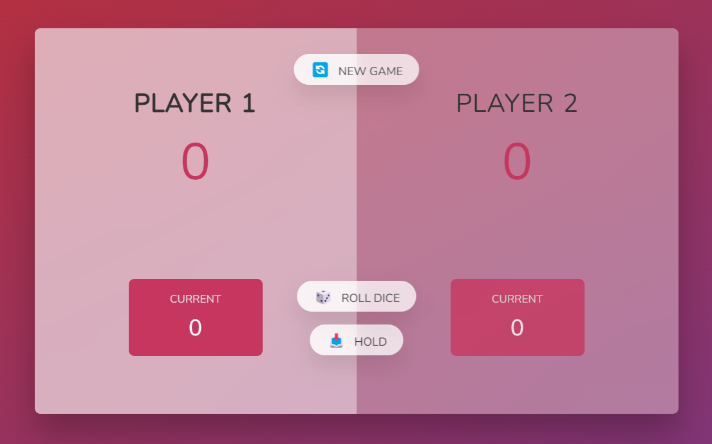

 
 
 
  
  
  	
  
  
   

 
 

**In Portuguese**

<h1 align="center">Repositório do Jogo Pig Game</h1>

Projeto criado para colocar em prática conhecimentos de HTML, CSS e JavaScript

 
 

**In English**

<h1 align="center">Game Pig Game´s Repository</h1>

Project created to put in practice HTML, CSS and JavaScript knowledge.

 

<h2><u>Encontre-me / Find-me :</u></h2>  

   
   
    

